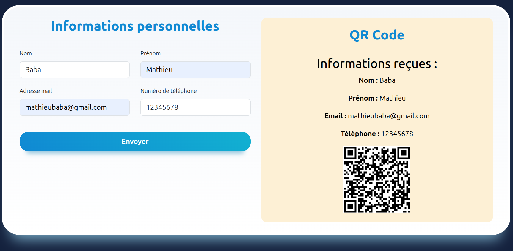

# Formulaire d’informations personnelles avec génération de QR Code
Ce mini-projet est une application web simple qui permet à un utilisateur de saisir ses informations personnelles (nom, prénom, email, téléphone) dans un formulaire. Après validation côté client, les données sont envoyées au serveur via AJAX (sans rechargement de la page) vers un script PHP (process.php), qui traite les données et génère un QR Code. Le serveur renvoie ensuite une réponse JSON contenant les données reçues et l’URL du QR Code, qui sont affichés dynamiquement sur la page.

  

# Fonctionnalités 
* Validation simple des champs du formulaire (champs non vides, téléphone numérique)
* Envoi asynchrone des données au serveur via AJAX (XMLHttpRequest)
* Traitement côté serveur des données et génération d’un QR Code (dans process.php)
* Affichage dynamique des informations reçues et du QR Code sans recharger la page
* Messages d’erreur en cas de champs invalides ou erreur serveur

**Math-Baba** - [GitHub](https://github.com/Math-Baba)
